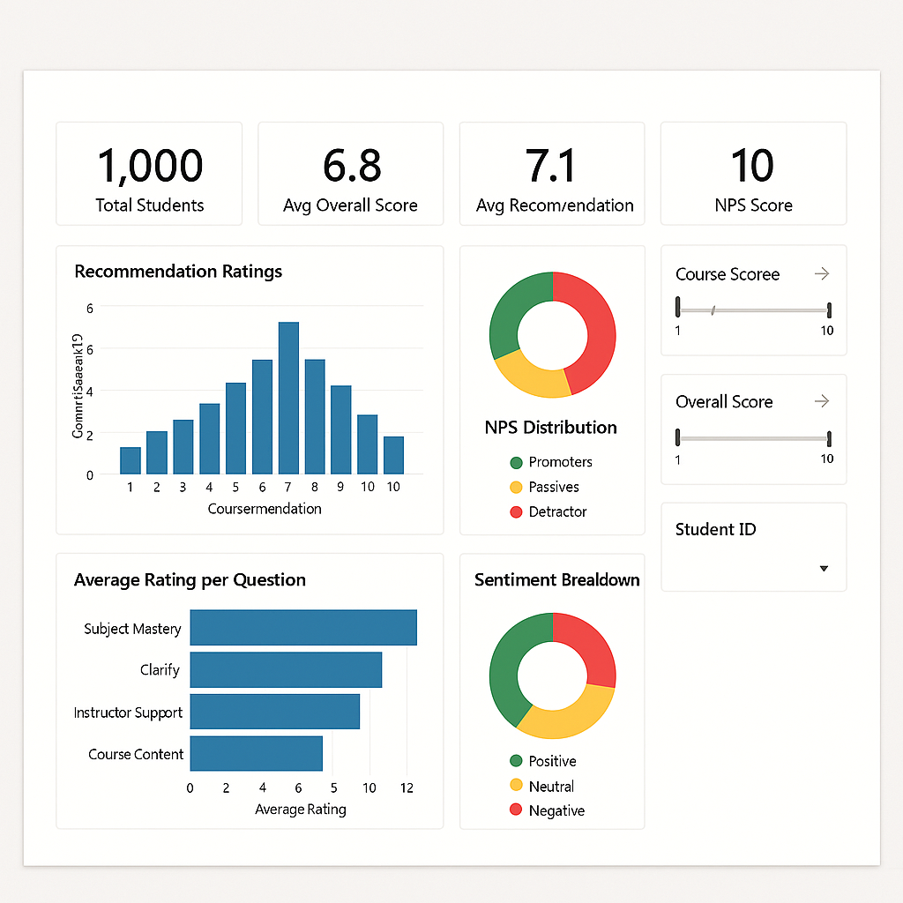

# 🎓 Student Feedback Analysis – Future Interns (Task 3)

This project is part of the **Future Interns Data Science & Analytics Internship**.  
The goal was to analyze student feedback from a college course to identify key strengths, pain points, and provide actionable recommendations.  

---

## 📂 Dataset
- **File:** `student_feedback.csv`  
- **Rows:** 1,001 students  
- **Columns:**  
  - `Student ID`  
  - Rating questions (1–10 scale): subject mastery, clarity, presentations, difficulty, doubts, course structure, support, course recommendation  

👉 The dataset was cleaned (`student_feedback_cleaned.csv`) by removing redundant index columns and ensuring numeric types.

---

## 🛠️ Tools & Libraries
- **Google Colab / Jupyter Notebook** (Python 3)  
- **pandas** – data cleaning & processing  
- **matplotlib & seaborn** – visualizations  
- **Power BI** (optional) – dashboard design  

---

## 📊 Methodology
1. **Data Cleaning**
   - Removed extra index column.
   - Ensured all rating fields were numeric.
   - Created an **Overall Score** per student (average across all factors except difficulty).

2. **Net Promoter Score (NPS)**
   - Classified students as:
     - **Promoter (8–10)**  
     - **Passive (5–7)**  
     - **Detractor (1–4)**  
   - Computed NPS = %Promoters − %Detractors.

3. **Sentiment Analysis (Proxy from Ratings)**
   - Since the dataset contained only numeric ratings (no text feedback), sentiment was derived as:  
     - **Positive:** 8–10  
     - **Neutral:** 5–7  
     - **Negative:** 1–4  
   - Calculated the distribution of positive, neutral, and negative responses per question.

4. **Visualizations**
   - Histogram of **Recommendation ratings**.
   - Bar chart of **Average score per question**.
   - Distribution of **NPS Buckets**.
   - Sentiment breakdown (Positive/Neutral/Negative).

5. **Insights & Recommendations**
   - Interpreted results into strengths and areas of improvement.

---

## 📈 Key Results
- **Average Overall Score (excl. difficulty):** ~5.98 / 10  
- **Average Recommendation Score:** ~5.6 / 10  
- **NPS Score:** −7.5 (more detractors than promoters)  

**Sentiment Distribution (Overall):**
- Positive: ~55%  
- Neutral: ~25%  
- Negative: ~20%  

**Top Strengths:**
- Subject mastery (avg: 7.5)  
- Concept clarity  
- Use of presentations  

**Areas for Improvement:**
- Willingness to solve doubts (avg: 5.5)  
- Course structure (avg: 5.6)  
- Student support (avg: 5.7)  

---

## 📬 Recommendations Summary
- **Enhance student support & doubt resolution** → introduce structured Q&A sessions, office hours, and more accessible mentorship to improve satisfaction in “Solves doubts willingly” and “Provides support” areas.  
- **Improve course structure & pacing** → provide clearer syllabi, weekly learning objectives, and checkpoints to raise scores in “Structuring of the course.”  
- **Boost engagement with presentations & clarity** → continue leveraging presentations and strong subject mastery (already top strengths) while refining delivery for more consistent understanding.  
- **Target passive and detractor groups** → focus interventions on students rating 1–7 to shift them towards promoters, which will directly lift the Net Promoter Score (NPS).  

---

## 📊 Dashboard 
- **KPIs:** Avg Overall Score, Avg Recommendation, NPS Score, Promoter %  
- **Charts:**  
  - Histogram of Recommendation ratings  
  - Avg rating by question  
  - NPS Bucket distribution  
  - Sentiment distribution  

## 📁 View Dashboard

---

## 🚀 How to Run
1. Open the notebook in **Google Colab** or locally in Jupyter:
   - [student_feedback_analysis.ipynb](student_feedback_analysis.ipynb)  
2. Upload `student_feedback.csv` when prompted.  
3. Run all cells to reproduce cleaning, analysis, sentiment, and charts.  
4. Export `student_feedback_cleaned.csv` for dashboard use.  

---

## 📎 Files in Repository
- `student_feedback.csv` – original dataset  
- `student_feedback_cleaned.csv` – cleaned dataset for analysis/Power BI  
- `student_feedback_analysis.ipynb` – Colab/Jupyter notebook with full workflow  
- `README.md` – project documentation (this file)  

---

## 🔗 Links
- **Google Colab Notebook:** [Open in Colab](https://colab.research.google.com/drive/1eKWL87qQND1weutIQ4prJb-tevqSugwO?usp=sharing)  
- 💼 [LinkedIn](https://www.linkedin.com/in/mugumya-timothy-kitulazi-711052217)  
- 🌐 Internship: [Future Interns – Data Science & Analytics](https://futureinterns.com/data-science-analytics-task-3/)  
